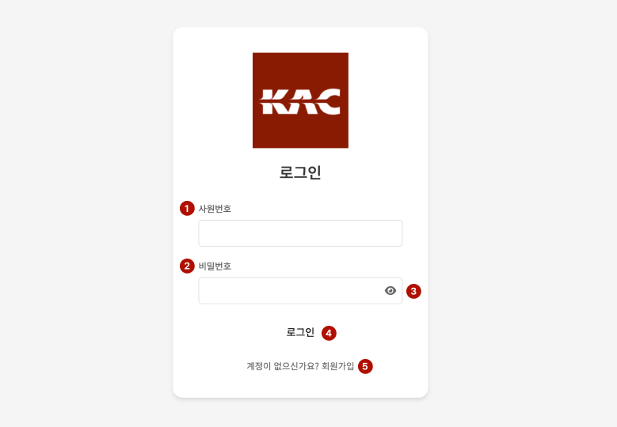
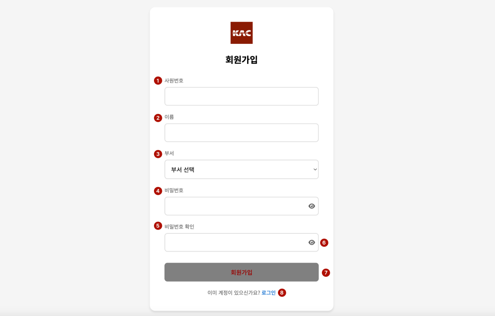
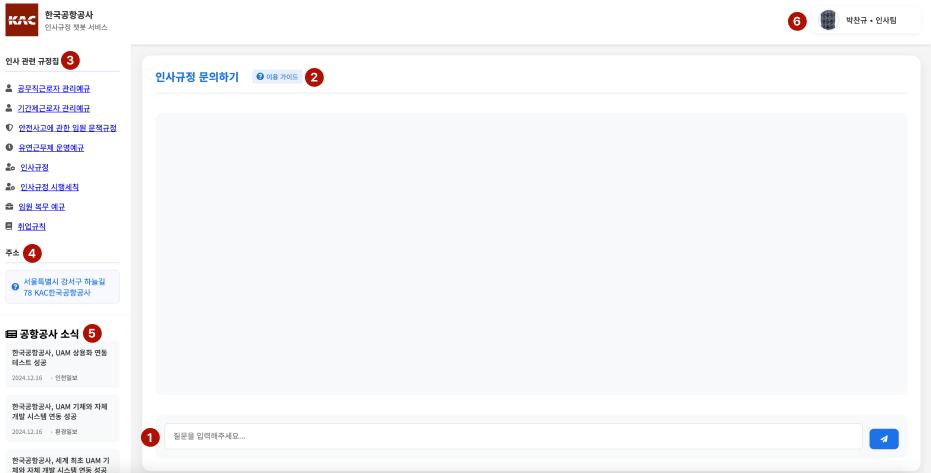
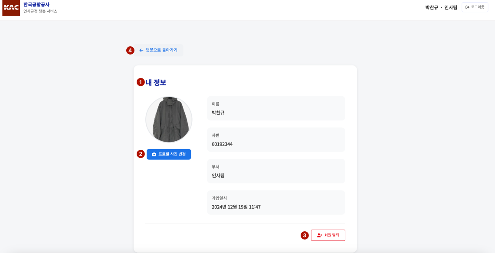

# SKN05-4RD-3TEAM

### 🤖 4차 프로젝트: LLM 연동 내외부 문서 기반 질의응답 시스템  
**프로젝트명:** 법률 확인 챗봇 시스템  
**개발기간:** 2024.11.26 - 2024.11.27  

## 💻 팀 소개

**팀명:** 보람3조  

| **김요은👩‍💻** | **박찬규👨‍💻** | **김혜서👩‍💻** | **박보람👩‍💻** |
|:--------------:|:--------------:|:--------------:|:--------------:|
| @usey10        | @thanGyuPark   | @Hyeseo20      | @pbr2858        |

### 📌 1. 프로젝트 개요
#### 개발 동기 및 목적 
본 프로젝트는 [SKNETWORKS-FAMILY-AICAMP 3차 프로젝트](https://github.com/SKNETWORKS-FAMILY-AICAMP/SKN05-3RD-3TEAM)를 기반으로 확장 개발된 프로젝트입니다.  
기업 내부의 법률 규정(인사, 징계, 복무 등)을 정확히 안내하는 챗봇 시스템을 구현하여 공항과 같은 특수 시설의 업무를 원활히 지원하고자 하였습니다.  

#### 필요성   
기존 챗봇 시스템은 일반적인 정보 제공에만 그치며, 특정 기업의 내부 법률 규정을 반영하지 못하는 한계를 가지고 있습니다.  
본 프로젝트는 공항에서 적용되는 내부 법률 규정에 대한 정확하고 신속한 정보 제공을 통해 규정 접근성을 높이고 직원들의 이해를 돕는 데 목적이 있습니다.  

#### 개발 목표 
- **특화된 정보 제공**: 공항 내부 법률 규정 및 절차 반영  
- **정확성 향상**: 법률에 기반한 구체적이고 정확한 답변 제공  
- **사용자 경험 개선**: 직관적이고 빠른 UI/UX 설계  

본 시스템은 내부 직원들의 내부 법률 규정 접근성을 개선하고, 업무 효율성을 강화하는 데 중점을 두고 있습니다.  

### 📌 2. 기술 스택
#### 2.1. 프론트엔드

#### 2.2 백엔드 

 

### 📌 3. 요구사항 정의서
#### 3.1 사용자 관리
| **중분류**   | **요구사항명**         | **추가설명**                                        |
|--------------|-----------------------|---------------------------------------------------|
| 회원가입     | 기본 회원가입          | 사용자는 사원번호, 이름, 부서를 입력하고 회원가입 가능    |
| 회원가입     | 비밀번호 확인          | 비밀번호 입력 시 확인 기능 제공                      |
| 회원가입     | 오류 메시지 표시       | 필수 입력값 누락 시 오류 표시                        |
| 로그인       | 기본 로그인            | 사용자 ID와 비밀번호로 로그인 가능                    |
| 로그인       | 로그인 상태 유지       | 세션을 통해 로그인 상태 유지                         |
| 로그인       | 로그아웃              | 사용자는 언제든 로그아웃 가능                         |
| 프로필 관리  | 회원 탈퇴              | 사용자는 계정을 삭제하여 모든 정보를 제거할 수 있어야 함     |
| 프로필 관리  | 프로필 이미지 업로드   | 사용자는 프로필 이미지를 업로드 가능                  |

#### 3.2 챗봇 기능
| **중분류**         | **요구사항명**         | **추가설명**                                        |
|--------------------|-----------------------|---------------------------------------------------|
| 기본 챗봇 사용      | 질문 입력              | 사용자는 질문을 입력할 수 있어야 함                  |
| 기본 챗봇 사용      | 답변 출력              | 입력된 질문에 대해 챗봇 답변 출력                    |
| 기본 챗봇 사용      | 메시지 로그 관리       | 사용자의 채팅 내역을 로그로 관리                     |
| 도움말 기능         | 도움말 표시            | 챗봇 사용법 안내 제공                               |
| 뉴스 제공 기능      | 뉴스 제공              | 특정 키워드가 들어간 최신 뉴스 제공                   |
| 뉴스 제공 기능      | 뉴스 자동 업데이트     | 일정 시간마다 뉴스 내용 갱신                          |
| 자주 묻는 질문      | 규정집 다운로드        | 사이드바에 주요 카테고리(인사, 보수, 상벌, 복무 등) 표시 |
| 자주 묻는 질문      | 회사 주소              | 사용자는 회사 주소를 복사하여 활용에 용이하게 사용할 수 있음 |

#### 3.3 데이터 베이스 
| **중분류**      | **요구사항명**         | **기능 설명**                                        |
|-----------------|-----------------------|-----------------------------------------------------|
| 데이터 관리     | DB-001               | 텍스트 파일에서 데이터를 읽고 청크로 나누어 처리         |
| 데이터 관리     | DB-002               | 텍스트 청크를 벡터화하여 저장                        |
| 데이터 관리     | DB-003               | 입력된 키워드에 대해 유사 문서 5개 반환                |
| 데이터 초기화   | DB-004               | 기존 데이터베이스를 삭제하고 새로운 데이터로 초기화      |
| 검색 기능       | DB-005               | 검색 쿼리와 결과를 로그로 저장                       |
| 에러 처리       | DB-006               | 텍스트 파일이 비어있거나 청크 생성 실패 시 오류 메시지 제공 |

---

#### 📌 4. 화면 설계서 
##### 4.1 주요 화면 설계
  
  
##### 4.2. 로그인 화면
  
- **기능**: 
  - 사용자 ID와 비밀번호 입력을 통한 로그인
  - 유효성 검사 및 오류 메시지 제공
- **구성 요소**: 
  - ID/비밀번호 입력 필드, 로그인 버튼, 회원가입 및 비밀번호 재설정 링크
- **디자인 특징**: 
  - 버튼 강조 색상과 필드 도움말 툴팁 제공  

---

##### 4.3. 회원가입 화면
  
- **기능**: 
  - 사원번호, 이름, 부서, 비밀번호 입력 및 비밀번호 확인
  - 입력값 검증 및 실시간 피드백 제공
- **구성 요소**: 
  - 사원번호, 이름, 부서, 비밀번호 입력 필드, 비밀번호 확인 토글, 회원가입 버튼
- **디자인 특징**: 
  - 입력 필드 포커스 시 색상 변경  

---

##### 4.4. 챗봇 메인 화면
  
- **기능**: 
  - 사용자 질문에 대한 실시간 답변 제공 (RAG 및 LangChain 기반 LLM 활용)
  - 주요 카테고리, 공지사항, 최신 뉴스 표시
  - 대화 기록 저장 및 검색 지원
- **구성 요소**: 
  - 질문 입력창, 답변 출력 영역, 사이드바 (공지사항, 최신 뉴스 등)
  - 이용가이드 토글 버튼, 규정집 다운로드 버튼
- **디자인 특징**: 
  - 말풍선 스타일 대화창과 가독성을 높이는 글꼴 적용  

---

##### 4.5. 마이페이지 화면
  
- **기능**: 
  - 사용자 프로필 정보 확인 및 수정
  - 프로필 이미지 변경, 회원 탈퇴 기능
- **구성 요소**: 
  - 프로필 정보 섹션, 이미지 업로드 버튼, 회원 탈퇴 버튼
- **디자인 특징**: 
  - 명확한 시각적 요소와 회원 탈퇴 확인 팝업 제공  

---

#### 전체 페이지 플로우
  

### 📌 5. 시스템 구성도

### 📌 6. 테스트 계획 및 결과

### 📌 7. 한 줄 회고

• 김요은:  
• 박찬규:   
• 김혜서: 
• 박보람: 

